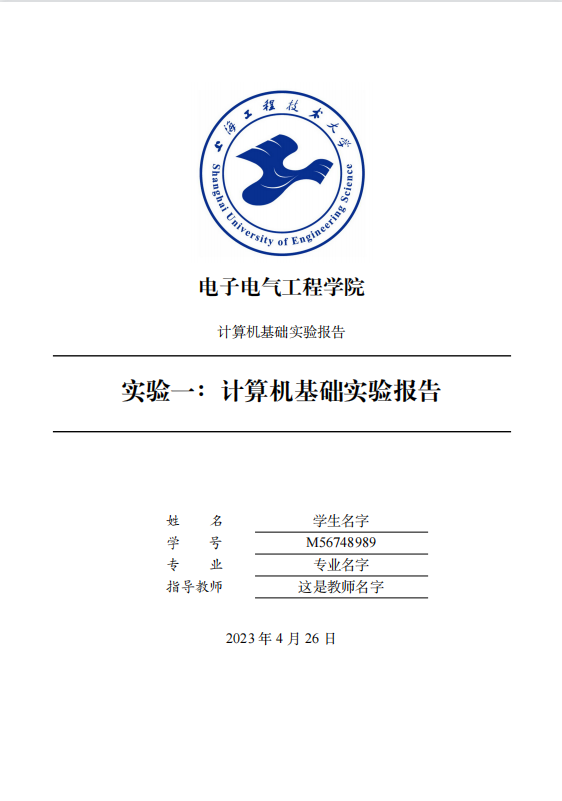

# 上海工程技术大学课程实验模板

本文件夹下包含有多个上海工程技术大学课程实验的latex模板，可以挑选符合自己课程的模板进行编译处理。

目前仅支持`xetex`编译的方式。有以下几种样式：

    <table>
        <tr>
            <td>样式1</td>
            <td>样式2</rd>
            <td>样式3</rd>
        </tr>
        <tr>
            <td>
                
            </td>
            <td>样式2图片</rd>
            <td>样式3图片</rd>
        </tr>
    </table>

